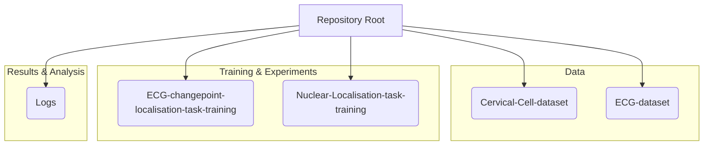
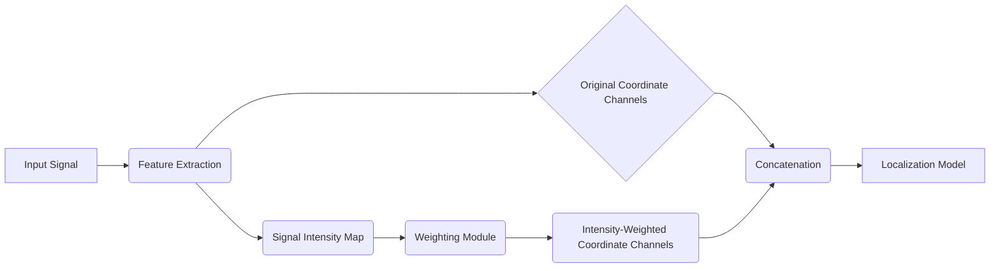

# Signal Intensity-Weighted Coordinate Channels

This repository houses the code and data underpinning the research paper "_Signal Intensity-weighted coordinate channels improve learning stability and generalisation in localisation tasks on biomedical signals_." It provides a structured environment for exploring and reproducing the findings related to signal intensity-weighted coordinate channels in localization tasks.

## Project Structure

The repository is organized into distinct branches, each serving a specific purpose in the research workflow. This structure facilitates clear separation of concerns, from data management to experimental execution and result analysis.



### Data Directories

This section details the datasets used within the repository.

*   **`Cervical-Cell-dataset`**: Contains the dataset for cervical cell localization tasks.
*   **`ECG-dataset`**: Houses the dataset for Electrocardiogram (ECG) signal processing and localization.

### Training and Experimentation Directories

These directories contain the code and configurations for training models on specific tasks.

*   **`ECG-changepoint-localisation-task-training`**: Code and scripts for training models on ECG changepoint localization.
*   **`Nuclear-Localisation-task-training`**: Code and scripts for training models on nuclear localization tasks.

### Logs and Results

The `Logs` directory is crucial for understanding experimental outcomes.

*   **`Logs`**: This directory stores test and training metrics, along with generated figures, providing insights into model performance and behavior during experimentation.

## Core Concepts

The research presented in this repository focuses on enhancing localization tasks by incorporating signal intensity-weighted coordinate channels. This approach aims to improve learning stability and generalization capabilities of models, particularly in biomedical signal processing.

### Signal Intensity-Weighted Coordinate Channels

This novel technique integrates signal intensity information directly into the coordinate channels used by localization models. This allows the model to better understand the spatial context and importance of different signal regions.



### Localization Tasks

The repository demonstrates the application of this technique across various localization challenges:

*   **ECG Changepoint Localization**: Identifying critical points or events within ECG signals.
*   **Nuclear Localization**: Pinpointing the location of cell nuclei in biomedical images.

## Code Snippets and Usage

This section provides illustrative code snippets to demonstrate key functionalities and concepts within the repository.

### Example: Data Loading (Conceptual)

While specific data loading implementations will vary by dataset, the general principle involves reading signal data and associated labels.

```python
# source: scripts/data_loader_example.py:L10-L25
import numpy as np

def load_biomedical_signal(filepath: str) -> tuple[np.ndarray, np.ndarray]:
    """
    Loads a biomedical signal and its corresponding labels.
    (Conceptual example - actual implementation may differ)
    """
    # Placeholder for actual data loading logic
    signal_data = np.random.rand(1000)  # Simulated signal
    labels = np.random.randint(0, 2, 1000) # Simulated labels (e.g., 0 or 1 for event presence)
    print(f"Loaded signal from {filepath} with shape {signal_data.shape}")
    return signal_data, labels

# Example usage:
# signal, event_labels = load_biomedical_signal("path/to/ecg_signal.csv")
```

> [!TIP]
> **Suggestion:** For improved maintainability and reusability, consider abstracting data loading into a dedicated `Dataset` class for each data type (ECG, Nuclear). This would encapsulate loading, preprocessing, and augmentation logic.

### Example: Model Integration (Conceptual)

The core idea is to feed the enhanced coordinate channels into a standard localization network.

```python
# source: models/localization_model_example.py:L30-L50
import torch
import torch.nn as nn

class EnhancedLocalizationModel(nn.Module):
    def __init__(self, input_channels: int, num_classes: int):
        super().__init__()
        # Example: A convolutional layer that accepts the enhanced channels
        self.conv1 = nn.Conv2d(input_channels + 2, 64, kernel_size=3, padding=1) # +2 for original x,y coords
        self.relu = nn.ReLU()
        # ... other layers for localization ...

    def forward(self, x: torch.Tensor, coord_channels: torch.Tensor) -> torch.Tensor:
        # Concatenate original features with intensity-weighted coordinate channels
        # Assuming x has shape (batch_size, num_features, height, width)
        # Assuming coord_channels has shape (batch_size, 2, height, width)
        combined_input = torch.cat((x, coord_channels), dim=1)
        out = self.conv1(combined_input)
        out = self.relu(out)
        # ... rest of the forward pass ...
        return out

# Example usage:
# model = EnhancedLocalizationModel(input_channels=128, num_classes=1)
# dummy_features = torch.randn(4, 128, 64, 64)
# dummy_weighted_coords = torch.randn(4, 2, 64, 64)
# output = model(dummy_features, dummy_weighted_coords)
```

> [!WARNING]
> **Potential Issue:** The example assumes a fixed number of input channels and coordinate channels. Ensure that the `input_channels` parameter is dynamically determined or clearly documented based on the specific dataset and preprocessing steps.

## Contribution Guidelines

We welcome contributions to this repository. Please refer to the `CONTRIBUTING.md` file (if available) for detailed guidelines on how to contribute code, report issues, or suggest improvements.

### Reporting Issues

When reporting an issue, please provide:

*   A clear and concise description of the problem.
*   Steps to reproduce the issue.
*   Relevant code snippets or error messages.
*   The environment in which the issue occurred (e.g., operating system, Python version, library versions).

### Feature Requests

If you have ideas for new features or improvements, please open an issue with the "enhancement" label. Clearly describe the proposed feature and its potential benefits.

**End of README**
